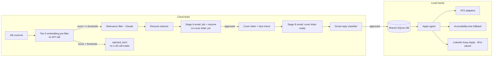

# JobFinder

An AI job-application assistant made of two cooperating components:

- **The cloud "brain"** (`scripts/run_brain.py`): polls job sources, screens
  postings locally with a free embedding pre-filter, filters for relevance
  with Claude, picks the best-fitting resume, and emails you a cheap Stage A
  approval request (job + resume, no cover letter yet). Once you approve
  that, it drafts and fact-checks a cover letter and emails a Stage B
  approval request. It watches both email threads for your reply (approve /
  reject / revise).
- **The local "hands"** (`scripts/run_local_agent.py`): runs on your own
  machine with your real, logged-in Chrome. Once you approve an application
  by email, it submits it automatically on the company's ATS site, or - for
  LinkedIn Easy Apply - fills the whole form and pauses one step before the
  final submit so you can review and click it yourself.

Both components share one local SQLite datastore (`data/jobfinder.db`).



## Setup

1. **Python env**
   ```bash
   python -m venv .venv
   source .venv/Scripts/activate   # Windows Git Bash; use .venv\Scripts\activate.bat on cmd
   pip install -r requirements.txt
   playwright install chrome
   ```

2. **Environment variables**: copy `.env.example` to `.env` and fill in:
   - `ANTHROPIC_API_KEY` - from [platform.claude.com](https://platform.claude.com).
   - `GMAIL_CLIENT_SECRET_FILE` / `GMAIL_TOKEN_FILE` - see "Gmail setup" below.
   - `GMAIL_USER_EMAIL` - the address approval-request emails are sent to/from.
   - `APPLICANT_NAME` - used to sign cover letters and fill application forms.
   - `JOBFINDER_DB_PATH` - defaults to `data/jobfinder.db`.
   - `CHROME_USER_DATA_DIR` - defaults to `chrome-profile/`.
   - `DAILY_APPLICATION_CAP` - max automatic submissions per day (default 15).
   - `TIER0_MIN_SIMILARITY` - 0-1 cosine-similarity cutoff for the local
     embedding pre-filter (default `0.35`); postings scoring below this
     never reach the Claude relevance call. Lower it if you're seeing too
     few candidates, raise it if too many obviously-irrelevant postings are
     reaching the (paid) relevance filter.
   - `TIER0_MODEL_NAME` - sentence-transformers model id for the pre-filter
     (default `all-MiniLM-L6-v2`, ~90MB, downloaded once and cached under
     `~/.cache/huggingface`).
   - `TIER1_MODEL_ENABLED` - kill-switch for the local tier-1 classifier
     (default `true` as of round 4's fresh-holdout validation; set `false`
     to revert to every posting going through Claude, unchanged from before
     this feature existed). See "Tier-1 local classifier" below.
   - `TIER1_NOT_RELEVANT_CONFIDENCE_MIN` - 0-1 confidence cutoff below which
     a tier-1 "not relevant" prediction falls back to a real Claude call
     instead (default `0.97`; see "Round 3" below for how this was derived).
   - `TIER1_RELEVANT_CONFIDENCE_MIN` - same, for "relevant" predictions
     (and the resume_variant pick that comes with them) - independent from
     the threshold above since the two prediction classes have very
     different failure costs (default `0.60`).
   - `TIER1_AGREEMENT_CHECK_RATE` - fraction of confident local decisions to
     double-check against Claude anyway, purely for accuracy tracking
     (default `0.5` - kept high for the first stretch of real production use;
     relax once live agreement data confirms round 4's validation holds up).
   - `TIER1_MODEL_PATH` - path to the quantized GGUF model file (default
     `models/tier1_classifier.q4_k_m.gguf`).

3. **Gmail setup** (least-privilege: `gmail.readonly` + `gmail.send`, never
   `gmail.modify`):
   - Create a Google Cloud project, enable the Gmail API.
   - Create an OAuth 2.0 Desktop client, download its JSON as
     `credentials/gmail_client_secret.json`.
   - The first time either script runs, it opens a browser for you to
     authorize; the resulting token is cached at
     `credentials/gmail_token.json` and refreshed automatically afterward.

4. **Resumes**: add your real `.docx` files at `resumes/fullstack.docx` and
   `resumes/project_manager.docx`. Nothing is fabricated here - if a file is
   missing you'll get a clear `FileNotFoundError` pointing at the expected path.

5. **LinkedIn job alerts**: this project never scrapes linkedin.com directly.
   Instead, set up a job-alert search on linkedin.com (Jobs -> Search ->
   "Create job alert") with email notifications turned on, sent to the same
   inbox `GMAIL_USER_EMAIL` points at. JobFinder reads those digest emails.

6. **Seed your Chrome profile** (once, before running the local agent):
   ```bash
   python scripts/seed_chrome_profile.py
   ```
   This opens a real Chrome window using a persistent profile at
   `CHROME_USER_DATA_DIR`; log into LinkedIn (and any ATS accounts you use)
   by hand, then press Enter in the terminal. No password is ever stored or
   typed by this project - only your real, cookie-based Chrome session is
   reused afterward.

## Running

```bash
python scripts/run_brain.py         # cloud brain: polling + notify + approval loop
python scripts/run_local_agent.py   # local hands: submits approved applications
```

Run them as two long-lived processes (e.g. two terminals, or two systemd/
Task Scheduler services). The brain can run anywhere; the local agent must
run on the machine with the seeded Chrome profile.

## Testing

```bash
pytest -q
```

147 tests as of this writing, covering resume parsing, Gmail OAuth/client,
job sources, scraping utilities, the local embedding pre-filter, the
Claude-backed relevance/resume/cover-letter/approval-reply modules (both
approval stages), the local apply agent, ATS adapters, both
browser-automation tool loops, and the tier-1 local classifier's
confidence-routing/fallback/kill-switch/training-data-logging behavior.

## Cost controls: tier-0 pre-filter and two-stage approval

Two changes reduce Claude API spend without changing what actually gets
submitted:

- **Tier-0 embedding pre-filter** (`jobfinder/ai/tier0_filter.py`): before
  the Claude relevance call, each posting's title+description is embedded
  locally (via `sentence-transformers`, no network/API call after the model
  is first downloaded) and compared by cosine similarity against both
  resume variants. Postings scoring below `TIER0_MIN_SIMILARITY` are logged
  as `rejected_tier0` (an Application row is still created for audit/review)
  and never reach any Claude call at all. `run_brain.py` logs a per-cycle
  score distribution (min/max/median, passed/rejected counts) so you can see
  how many LLM calls were avoided and retune the threshold.
- **Two-stage approval** (`jobfinder/pipeline.py`,
  `jobfinder/gmail/approval_loop.py`): a posting that passes both filters
  first gets a cheap Stage A email (job details + which resume was picked
  and why - no cover letter). Only once you reply APPROVE to that does the
  (comparatively expensive) cover-letter-generation + fact-check Claude call
  run, followed by the existing Stage B "cover letter ready" email for final
  sign-off. Rejecting or asking for the other resume at Stage A costs
  nothing beyond the initial relevance/resume-selection calls - the cover
  letter is never drafted for postings you'd have rejected anyway.

### Cover-letter requirement detection

Not every application form wants (or has room for) a full cover letter, so
each `Application` gets a `cover_letter_requirement` field -
`none` | `short_note` | `full_letter` - decided once, at posting-creation
time, before Stage B ever runs:

- **Recognized ATS templates** (Greenhouse, Lever, Workday, Comeet,
  SmartRecruiters, JazzHR - see `jobfinder/local/ats/`) declare their field
  type as a static class attribute on each adapter, since it's already known
  for free (e.g. Lever's form has no dedicated cover-letter field, just a
  generic "Additional Information" box, so it's classified `short_note`).
- **Everything else** (LinkedIn Easy Apply, or a company-site posting on an
  unrecognized/bespoke career page) falls back to a cheap heuristic scan of
  the posting text (`jobfinder/ai/cover_letter_requirement.py`) for explicit
  signals ("no cover letter needed", "cover letter optional", a stated
  character limit, etc.), defaulting to `full_letter` when nothing matches -
  skipping a wanted letter is worse than generating an unneeded one.

`process_stage_a_approval` branches on this field: `none` skips
cover-letter generation entirely (a lightweight Stage B email is sent
instead, with no cover-letter section) and `short_note`/`full_letter` pass
the requirement (plus any known `cover_letter_char_limit`) into
`generate_cover_letter` to select the matching prompt/length target (see
below). If the local apply step later finds the real form doesn't actually
match the upfront classification, it adapts the already-approved letter
locally (truncating for a short field, or leaving it blank for none) rather
than re-calling Claude, and logs a `cover_letter_classification_mismatch`
event on the Application for visibility.


A fine-tuned local model can take over the relevance-filter and
resume-selection Claude calls for postings that already passed tier-0,
further cutting API spend once enough real usage has accumulated training
data. Enabled by default (`TIER1_MODEL_ENABLED=true`) since round 4's
fresh-holdout validation confirmed round 3's model generalizes to unseen
data (see "Round 4" below) - set `TIER1_MODEL_ENABLED=false` to instantly
revert to the plain Claude path described above if live traffic ever
disagrees with the offline validation.

How it works (`jobfinder/ai/tier1_classifier.py`):

- A small LoRA-fine-tuned Qwen2.5-1.5B-Instruct model (quantized to GGUF,
  served locally via `llama-cpp-python`, no network call) predicts both
  decisions - relevant yes/no and which resume fits.
- Confidence for each decision is derived at inference time from the model's
  own output-token probabilities (via llama.cpp's `logprobs`), not a number
  the model was trained to emit - round 1 had the model output a
  "confidence" field directly, but training labels always used a small set
  of fixed placeholder values, so the model just learned to reproduce those
  constants (see "Round 2" below). `resume_confidence` only gates routing
  when the model predicted `relevant=True`, since `resume_variant` is never
  acted on downstream for a rejected posting.
- Routing is asymmetric (`Tier1Decision.is_confident`, see "Round 3" below):
  a "not relevant" prediction is trusted only at or above
  `TIER1_NOT_RELEVANT_CONFIDENCE_MIN`, while a "relevant" prediction (and its
  resume_variant pick) is trusted only at or above the independent, looser
  `TIER1_RELEVANT_CONFIDENCE_MIN` - a false "not relevant" silently drops a
  job the candidate would have wanted (unrecoverable), while a false
  "relevant" just costs one extra cheap Stage-A email, so the two are held
  to different bars on purpose. Anything that doesn't clear its threshold
  (or if the model errors, or `TIER1_MODEL_ENABLED=false`, or no model file
  exists yet) falls back to the real Claude relevance/resume-selection
  calls, exactly as before.
- A random fraction of confident local decisions (`TIER1_AGREEMENT_CHECK_RATE`)
  are still double-checked against Claude purely to track real-world
  agreement over time (`tier1_decisions` table, queryable via
  `store.summarize_tier1_decisions()`; `run_brain.py` logs a per-cycle
  summary alongside the tier-0 stats).
- Every genuine Claude decision (fallback or otherwise) is logged as a
  labeled training example (`tier1_training_examples` table), so production
  traffic continuously grows the dataset available for future fine-tuning
  rounds even before a model exists.

Training pipeline (`scripts/tier1/`, adapted from the sibling SmartServe
project's fine-tuning approach - same base model, same LoRA hyperparameters,
same Claude-teacher-labeling workflow):

```
scripts/tier1/
  requirements.txt              # heavy training-only deps, kept separate from
                                 # the main requirements.txt
  generate_synthetic_postings.py  # deterministic synthetic postings (free)
  label_examples.py             # labels them via the real Claude relevance/
                                 # resume-selector logic (real API calls)
  split_dataset.py              # exports DB examples -> train/val/eval JSONL
  config.yaml                   # base model, LoRA + training hyperparameters
  train.py                      # Unsloth + TRL LoRA fine-tuning
  quantize.py                   # GGUF quantization (q4_k_m)
  evaluate.py                   # held-out eval accuracy, confusion matrices,
                                 # and confidence-calibration table (reuses
                                 # stored labels, no live Claude calls)
```

Running the full pipeline requires installing
`scripts/tier1/requirements.txt` (torch/unsloth/trl/bitsandbytes - heavy,
GPU strongly recommended) and will make real, paid Claude API calls during
`label_examples.py`. See each script's module docstring for exact usage.

**Round 1 (655 examples, ~21%/79% relevant/not split)**: 400 synthetic +
250 resume-keyword-biased synthetic postings, split 502/55/98 train/val/eval,
3 epochs LoRA fine-tuning on an RTX 5060 Laptop GPU (~9 min), quantized to
q4_k_m (~940MB).

| metric | round 1 |
|---|---|
| relevance accuracy | 77.6% |
| majority-class baseline | 78.6% (**model was below baseline**) |
| relevance confusion (expected relevant: TP / FN) | 0 / 21 |
| relevance confusion (expected not relevant: FP / TN) | 1 / 76 |
| resume-variant accuracy (relevant only) | 66.7% |
| combined accuracy | 77.6% |

The confusion matrix showed the round-1 model had collapsed to predicting
"not relevant" almost universally (0 true positives out of 21 genuinely
relevant eval examples) - it had learned the majority-class shortcut, not
the actual decision boundary, on a training set that was ~79% one class.
Confidence was also a near-constant placeholder (training labels used fixed
values like 0.9/0.95 regardless of the actual example), so it reproduced
those same numbers at inference time - useless for `TIER1_CONFIDENCE_MIN`
routing.

**Round 2 (`feature/tier1-retrain-v2`, 1355 examples, ~44.6%/55.4% relevant/
not split)**: added 700 new synthetic postings deliberately biased toward
the relevant class (junior/entry-level fullstack + PM postings using
resume-aligned language), labeled only the new ones via Claude (reusing
round 1's 655 existing labels), and rebuilt the split - keeping round 1's
98 held-out eval postings intact for comparability (11 exact-content
duplicates across the two synthetic batches also matched by input text and
were pulled into eval alongside them, growing it to 109 examples; all 98
original postings are still included). Also replaced the placeholder
confidence with real logprob-derived confidence (see above) and fixed two
bugs found along the way: `split_dataset.py` was hardcoding a fixed
"confidence" in training labels regardless of the actual example, and
`tier1_classifier.parse_completion` was discarding an otherwise-correct
"not relevant" decision whenever the model emitted an out-of-schema
`resume_variant` value like `"none"` (now defaults to a placeholder variant
with zero confidence in that case, since resume_variant is never acted on
for a rejected posting).

| metric | round 1 | round 2 |
|---|---|---|
| relevance accuracy | 77.6% | **82.6%** |
| majority-class baseline | 78.6% | 78.9% |
| vs. baseline | below | **+3.7pts above** |
| relevance confusion (expected relevant: TP / FN) | 0 / 21 | 4 / 19 |
| relevance confusion (expected not relevant: FP / TN) | 1 / 76 | 0 / 86 |
| resume-variant accuracy (relevant only) | 66.7% | 69.6% |
| combined accuracy | 77.6% | 82.6% |
| confidence calibration | not meaningful (near-constant) | monotonic - see below |

Round 2's confidence-calibration table (accuracy by quartile of the routing
confidence `is_confident()` actually gates on) now shows a real, monotonic
relationship between confidence and correctness:

| bucket | avg confidence | accuracy |
|---|---|---|
| Q1 (lowest) | 0.741 | 46.4% |
| Q2 | 0.916 | 85.7% |
| Q3 | 0.987 | 100% |
| Q4 (highest) | 1.000 | 100% |

**Judgment: not yet strong enough to enable `TIER1_MODEL_ENABLED`.** Round 2
is genuine progress - it now beats the majority-class baseline (round 1
didn't), zero false positives, and confidence is a real, calibrated signal
that correlates with accuracy. But relevant-class recall is still weak (4/23,
17.4%) - the model remains heavily biased toward predicting "not relevant,"
just less severely than round 1 (0/21). With only 23 relevant examples in
the eval set, these numbers are also fairly noisy. **Recommendation: keep
`TIER1_MODEL_ENABLED=false`** and consider a round 3 that further improves
relevant-class recall (e.g. more real production-logged examples once
enough accumulate, an even larger/more diverse relevant-biased synthetic
batch, or a recall-weighted training objective) before reconsidering enabling
it - the confidence-routing infrastructure is now trustworthy (round 2's
fix), so once relevance recall genuinely improves, low-confidence cases will
correctly still fall back to Claude rather than being silently wrong.

**Round 3 (`feature/tier1-recall-and-asymmetric-routing`, 2255 examples,
44.8%/55.2% relevant/not split)**: two goals this round - improve
relevant-class recall specifically, and replace the single
`TIER1_CONFIDENCE_MIN` threshold with two independent, asymmetric ones since
a missed-relevant posting (silent, unrecoverable) and a wrongly-flagged one
(one extra cheap Stage-A email) are not equally costly.

*Data*: extended `generate_synthetic_postings.py` with a `HARD_POSITIVE_*`
snippet/title pool (`--hard-positive-fraction`) - support/QA/retail-ops-worded
postings designed to genuinely match a resume without using the obvious
buzzwords the earlier `STRONG_MATCH_*` pool leaned on (e.g. a "Technical
Support Engineer" posting that's quietly doing Python scripting/automation, or
a "Shift Lead" role that's quietly doing the same budget/staff-leadership work
as the PM resume). Generated and labeled 500 such postings via the real
Claude teacher - only 65 (13%) came back genuinely relevant, far below the
targeted 65%, meaning most of these hard-positive-*designed* postings were
themselves judged not relevant by Claude. That's useful signal either way: it
produced real hard-negative examples that superficially resemble relevant
postings (combating a keyword-shortcut model), but it also dragged the
overall relevant-class proportion down, so a second supplemental batch (400
postings, pure clearly-relevant `STRONG_MATCH_*`, the same lever round 2
used) restored the ratio to a round-2-comparable 44.8%/55.2% while keeping
all the new hard examples. The eval set was kept fixed (round 2's 109
examples, +3 more exact-content duplicate matches -> 112, relevant count
unchanged at 23) so recall numbers are directly comparable across rounds.

*Routing*: `Tier1Decision.is_confident()` now takes independent
`not_relevant_threshold`/`relevant_threshold` params (defaulting to the two
new config constants) instead of one shared threshold; `decide()` is
unchanged (still calls `is_confident()` with no args).

| metric | round 1 | round 2 | round 3 |
|---|---|---|---|
| relevance accuracy | 77.6% | 82.6% | **92.9%** |
| majority-class baseline | 78.6% | 78.9% | 79.5% |
| vs. baseline | below | +3.7pts above | **+13.4pts above** |
| relevance confusion (expected relevant: TP / FN) | 0 / 21 | 4 / 19 | **17 / 6** |
| relevance confusion (expected not relevant: FP / TN) | 1 / 76 | 0 / 86 | 2 / 87 |
| **relevant-class recall** | 0% | 17.4% | **73.9%** |
| relevant-class precision | n/a | 100% | 89.5% |
| resume-variant accuracy (relevant only) | 66.7% | 69.6% | **95.7%** |
| combined accuracy | 77.6% | 82.6% | 92.0% |

Relevant-class recall (this round's headline metric, not overall accuracy)
went from 4/23 to **17/23 (73.9%)** - a 4x+ improvement, and the model no
longer defaults to "not relevant" as its dominant behavior.

Per-predicted-class confidence calibration (the actual basis for the two
threshold defaults, not a guess):

| bucket | predicted "not relevant": avg conf | accuracy (genuinely not relevant) | predicted "relevant": avg conf | accuracy (genuinely relevant) |
|---|---|---|---|---|
| Q1 | 0.782 | 79.2% | 0.609 | 80.0% |
| Q2 | 0.985 | 95.8% | 0.705 | 80.0% |
| Q3 | 1.000 | 100% | 0.861 | 100% |
| Q4 | 1.000 | 100% | 0.972 | 100% |

The quartile table alone suggested `TIER1_NOT_RELEVANT_CONFIDENCE_MIN=0.95`
would be safe (accuracy looks ~100% from there up), but a direct per-example
check - listing every false negative's own `relevance_confidence`, not just
the aggregated buckets - found one at **0.966** that would have cleared a
0.95 cutoff and been silently auto-handled *wrong*. That case is invisible
in the quartile view (it sits inside Q2's 95.8%-accurate bucket). Raised the
default to **0.97** to exclude it, then re-verified: auto-handled coverage
drops slightly (76.8% -> 72.3%) but accuracy among auto-handled rises (96.5%
-> 97.5%). **Always do this per-example check, not just eyeball the quartile
table, before trusting a threshold** - it's the difference between an
aggregate that looks fine and a specific, real silent-miss risk.

`TIER1_RELEVANT_CONFIDENCE_MIN` stays at **0.60**, now backed by 19
predicted-relevant examples (round 2 only had 4) instead of an
under-powered guess: 80% accurate around 0.61-0.70 confidence, 100% by
~0.86+, and a wrong "relevant" call is cheap by design, so a looser bar than
the not-relevant side is intentional, not an oversight.

**Projected routing @ these thresholds**: of the 112 eval postings, **81
(72.3%) would be auto-handled locally** and **31 (27.7%) would fall back to
Claude** - the real expected cost savings, with 97.5% accuracy among the
postings actually auto-handled.

**Judgment: recommend enabling `TIER1_MODEL_ENABLED=true`.** This round
fixes both of round 2's open problems: relevant-class recall is no longer
the weak point (73.9%, up 4x from 17.4%), and the single shared confidence
threshold has been replaced with two independently-derived, asymmetric ones
that were validated against the actual failure mode that matters most (a
per-example false-negative-confidence audit, not just an aggregate table).
Nearly three-quarters of postings would be handled locally at 97.5%
accuracy, with the remaining quarter correctly deferred to Claude. The
caveat: the eval set is still modest (112 examples, 23 relevant), so these
percentages carry real sampling uncertainty at this scale. Recommend
enabling with active monitoring of `store.summarize_tier1_decisions()`'s
agreement rate (the existing `TIER1_AGREEMENT_CHECK_RATE` spot-check keeps
running regardless of which path was taken) and re-running the same
per-example false-negative audit once more real eval data accumulates,
rather than treating this as a fully closed question - but the evidence this
round supports turning it on, which round 1 and round 2 did not.

**Round 4 (`feature/tier1-fresh-holdout-validation`, fresh-holdout
validation - no retraining)**: round 3's headline numbers came from an eval
set (112 examples) that was itself derived from the same generator/config
seed lineage as the training data, so this round asks a different question:
does round 3's already-trained model actually generalize, or did it just get
lucky against a familiar-flavored eval set? **No model, threshold, or
routing code changed this round** - only `evaluate.py`, already run as-is,
against genuinely new data.

*Freshness verification*: `generate_synthetic_postings.py` draws from a
finite combinatorial pool of titles/companies/description snippets, so even
a brand-new random seed isn't guaranteed to avoid exact duplicates against
2000+ existing labeled examples - confirmed real: a batch of 220 freshly-seeded
postings (`--seed 20260903`) turned out to have **33 (15%) exact-text
duplicates** against rounds 1-3's data (concentrated in the low-cardinality
"unrelated" title/snippet bucket). Built `scripts/tier1/verify_fresh_holdout.py`
to hash every candidate's classifier input text (title + company +
description) and diff against hashes of every existing `train`/`val`/`eval`
JSONL and raw synthetic-postings file, then filtered the 33 duplicates out.
The remaining **187 postings verified as 0/187 overlap** with any prior
round's data - this is the fresh holdout set. It was labeled via the same
real Claude `relevance`/`resume_selector` calls used in prior rounds, but
written to a standalone file (`scripts/tier1/label_fresh_holdout.py`) that
never touches the `tier1_training_examples` DB table, so it can never
leak into a future training or eval split.

| metric | round 3 (eval, n=112) | round 4 (fresh holdout, n=187) |
|---|---|---|
| relevance accuracy | 92.9% | **98.9%** |
| majority-class baseline | 79.5% | 82.4% |
| relevance confusion (expected relevant: TP / FN) | 17 / 6 | **31 / 2** |
| relevance confusion (expected not relevant: FP / TN) | 2 / 87 | 0 / 154 |
| **relevant-class recall** | 73.9% | **93.9%** |
| relevant-class precision | 89.5% | **100%** |
| resume-variant accuracy (relevant only) | 95.7% | 97.0% |
| auto-handled locally @ current thresholds | 81/112 (72.3%) | **158/187 (84.5%)** |
| accuracy among auto-handled | 97.5% | **100%** |
| false-negative rate among auto-handled | ~2.5% | **0%** |

Every headline metric held or improved on genuinely fresh data: relevant-class
recall rose from 73.9% to 93.9%, precision rose from 89.5% to 100%, a larger
share of postings (84.5% vs 72.3%) qualified for local auto-handling, and
**zero** of the 158 auto-handled fresh predictions were wrong (vs round 3's
implied ~2.5% false-negative rate among its own auto-handled set). There is
no sign of the model having overfit to the training distribution's specific
phrasing.

**Judgment: round 3's numbers generalize - this is a real pass, not a close
call.** No hedging needed: recall and precision both improved rather than
regressed on unseen data, and the auto-handled subset (the actual
production-risk surface) had zero errors. The caveat carried over from round
3 still applies at a smaller magnitude - 33 relevant examples in this fresh
set is still a modest sample, so exact percentages (particularly 100%
accuracy/precision) will not stay exactly at 100% forever - but there is no
directional weakness to explain away. This validation itself makes **no
changes** to the model or to `TIER1_NOT_RELEVANT_CONFIDENCE_MIN` (0.97) /
`TIER1_RELEVANT_CONFIDENCE_MIN` (0.60) - it only confirms round 3's
recommendation to enable rests on firmer evidence than a single
self-similar eval set.

**Enabled in production.** Rounds 2, 3, and 4 have been merged into `main`
in that order, and `TIER1_MODEL_ENABLED` now defaults to **`true`**. Given
the fresh-holdout set behind this decision is still only 187 examples,
`TIER1_AGREEMENT_CHECK_RATE` was raised from its prior `0.1` default to
**`0.5`** for the first stretch of real production use - that spot-check
(logged to `tier1_decisions`, queryable via
`store.summarize_tier1_decisions()`) is what will actually reveal it if real
traffic looks different from synthetic data in some way none of rounds 1-4
happened to surface. Once a few weeks of live agreement data confirms it
holds up, relax the check rate back down (e.g. to `0.1`) and trust the model
more fully.

## Project structure

```
jobfinder/
  config.py              # central config: model id, paths, thresholds, secrets
  db/                     # SQLite schema, models, and access layer
  resume/                 # .docx parsing + mtime-cached parsed JSON
  gmail/                  # OAuth, thin API client, Stage A/B approval-request
                           # emails, reply classification/approval loop
  sources/                # JobSource interface, scheduler, and per-site sources
                           # (gotfriends, devjobs, linkedin_email, jobinfo stub)
  ai/                      # shared Anthropic client + tier-0 embedding filter,
                           # relevance filter, resume selector, cover letter
                           # generator, tier-1 local classifier (optional)
  local/                   # the "hands": apply agent, browser session,
                           # ATS adapters, accessibility-tree tool loops
  pipeline.py              # wires tier0 -> tier1/claude routing -> Stage A ->
                           # (on approval) cover letter -> Stage B
  tracking.py              # status/log lifecycle queries
scripts/
  seed_chrome_profile.py   # one-time manual Chrome login
  run_brain.py             # cloud brain entrypoint
  run_local_agent.py       # local hands entrypoint
  tier1/                   # tier-1 local classifier training pipeline (see
                           # "Tier-1 local classifier" above)
```

## Assumptions and deviations (read this)

This project was built to an extremely detailed spec with the instruction
to ask if something was ambiguous, otherwise use best judgment and note the
assumption. Here's everything worth knowing before you rely on it:

- **Custom browser-automation tools instead of Anthropic's built-in
  computer-use/browser-use toolsets.** Anthropic offers screenshot+pixel-
  coordinate driven tools for this; per an explicit preference, this project
  instead uses custom accessibility-tree tools (`list_elements`,
  `click_by_ref`, `fill_by_ref`, `upload_by_ref`, with `take_screenshot` only
  as a last resort). See `jobfinder/local/browser_apply_fallback.py` and
  `jobfinder/local/browser_apply_linkedin.py`.
- **LinkedIn is never scraped directly.** Job discovery from LinkedIn comes
  only from the user's own job-alert digest emails
  (`jobfinder/sources/linkedin_email.py`). The exact HTML markup of those
  digest emails was assumed (no real sample was available while building
  this) - if LinkedIn's email template drifts, `_parse_job_cards` in that
  file is the place to adjust extraction; nothing else depends on the markup
  details.
- **JobInfo (jobinfo.co.il) is intentionally unimplemented.** It serves a
  Cloudflare "Just a moment..." JS challenge to automated requests (verified
  with a real browser, not just a bare HTTP request). Building something to
  solve that challenge would mean bypassing an active anti-bot security
  control, which this project doesn't do. `jobfinder/sources/jobinfo.py`
  always returns an empty list and logs a warning explaining why.
- **GotFriends and DevJobs scrapers are grounded in real, verified page
  structure** (captured live while building this), not guessed CSS
  selectors - but external sites can still change their markup at any time;
  if scraping silently stops returning results, check
  `jobfinder/sources/gotfriends.py` / `devjobs.py` first.
- **Workday's ATS adapter is intentionally partial.** Workday's real apply
  flow is a multi-step SPA wizard that varies per employer; the adapter
  fills the initial identity fields and then always raises so the
  application is marked `stuck` for the accessibility-tree fallback or
  manual completion, rather than risking a wrong or incomplete
  auto-submission.
- **The 5 other ATS adapters (Greenhouse, Lever, Comeet, SmartRecruiters,
  JazzHR) use each platform's well-documented default field
  names/ids.** Companies can customize forms beyond this; a required field
  or submit button not being found raises `ATSFormError` rather than
  submitting a partially-filled form, and the local agent falls back to the
  accessibility-tree loop in that case.
- **LinkedIn Easy Apply is never auto-submitted.** The tool loop fills the
  entire form but has a hard-coded, code-level refusal (not just a prompt
  instruction) to click anything whose text matches "submit application" -
  it always stops one step early for you to review and click.
- **Resume-parsing heuristics** (Word heading styles, ALL-CAPS short lines,
  bold short paragraphs, bullet-prefix stripping) are conservative guesses
  about typical resume structure, not a fixed schema - see
  `jobfinder/resume/parser.py` if your resume's structure trips them up.
- **The style reference** (`config/style_reference.txt`) is used only for
  tone guidance in cover letters, never as a source of factual content.
- **Phone number is optional** (`APPLICANT_PHONE` in `.env`) - if set, it's
  supplied to ATS/LinkedIn form-filling like name/email/resume/cover letter;
  if left blank, the local agent stops and marks the application `stuck`
  rather than inventing a number or leaving a required field empty.
- **`ApplyMethod.EMAIL` has no registered handler yet** - no current job
  source produces email-apply postings, so this is untested in practice; an
  application with this apply method would be marked `stuck` by the local
  agent (`NotImplementedError`, caught and logged) rather than silently
  failing.