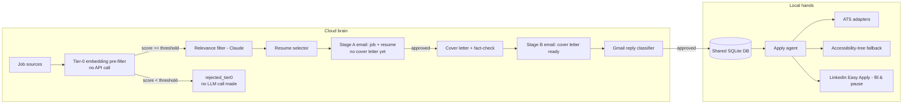

# JobFinder

An AI job-application assistant made of two cooperating components:

- **The cloud "brain"** (`scripts/run_brain.py`): polls job sources, screens
  postings locally with a free embedding pre-filter, filters for relevance
  with Claude, picks the best-fitting resume, and emails you a cheap Stage A
  approval request (job + resume, no cover letter yet). Once you approve
  that, it drafts and fact-checks a cover letter and emails a Stage B
  approval request. It watches both email threads for your reply (approve /
  reject / revise).
- **The local "hands"** (`scripts/run_local_agent.py`): runs on your own
  machine with your real, logged-in Chrome. Once you approve an application
  by email, it submits it automatically on the company's ATS site, or - for
  LinkedIn Easy Apply - fills the whole form and pauses one step before the
  final submit so you can review and click it yourself.

Both components share one local SQLite datastore (`data/jobfinder.db`).



## Setup

1. **Python env**
   ```bash
   python -m venv .venv
   source .venv/Scripts/activate   # Windows Git Bash; use .venv\Scripts\activate.bat on cmd
   pip install -r requirements.txt
   playwright install chrome
   ```

2. **Environment variables**: copy `.env.example` to `.env` and fill in:
   - `ANTHROPIC_API_KEY` - from [platform.claude.com](https://platform.claude.com).
   - `GMAIL_CLIENT_SECRET_FILE` / `GMAIL_TOKEN_FILE` - see "Gmail setup" below.
   - `GMAIL_USER_EMAIL` - the address approval-request emails are sent to/from.
   - `APPLICANT_NAME` - used to sign cover letters and fill application forms.
   - `JOBFINDER_DB_PATH` - defaults to `data/jobfinder.db`.
   - `CHROME_USER_DATA_DIR` - defaults to `chrome-profile/`.
   - `DAILY_APPLICATION_CAP` - max automatic submissions per day (default 15).
   - `TIER0_MIN_SIMILARITY` - 0-1 cosine-similarity cutoff for the local
     embedding pre-filter (default `0.35`); postings scoring below this
     never reach the Claude relevance call. Lower it if you're seeing too
     few candidates, raise it if too many obviously-irrelevant postings are
     reaching the (paid) relevance filter.
   - `TIER0_MODEL_NAME` - sentence-transformers model id for the pre-filter
     (default `all-MiniLM-L6-v2`, ~90MB, downloaded once and cached under
     `~/.cache/huggingface`).
   - `TIER1_MODEL_ENABLED` - kill-switch for the local tier-1 classifier
     (default `false`: every posting goes through Claude, unchanged from
     before this feature existed). See "Tier-1 local classifier" below.
   - `TIER1_CONFIDENCE_MIN` - 0-1 confidence cutoff below which a tier-1
     decision falls back to a real Claude call instead (default `0.85`).
   - `TIER1_AGREEMENT_CHECK_RATE` - fraction of confident local decisions to
     double-check against Claude anyway, purely for accuracy tracking
     (default `0.1`).
   - `TIER1_MODEL_PATH` - path to the quantized GGUF model file (default
     `models/tier1_classifier.q4_k_m.gguf`).

3. **Gmail setup** (least-privilege: `gmail.readonly` + `gmail.send`, never
   `gmail.modify`):
   - Create a Google Cloud project, enable the Gmail API.
   - Create an OAuth 2.0 Desktop client, download its JSON as
     `credentials/gmail_client_secret.json`.
   - The first time either script runs, it opens a browser for you to
     authorize; the resulting token is cached at
     `credentials/gmail_token.json` and refreshed automatically afterward.

4. **Resumes**: add your real `.docx` files at `resumes/fullstack.docx` and
   `resumes/project_manager.docx`. Nothing is fabricated here - if a file is
   missing you'll get a clear `FileNotFoundError` pointing at the expected path.

5. **LinkedIn job alerts**: this project never scrapes linkedin.com directly.
   Instead, set up a job-alert search on linkedin.com (Jobs -> Search ->
   "Create job alert") with email notifications turned on, sent to the same
   inbox `GMAIL_USER_EMAIL` points at. JobFinder reads those digest emails.

6. **Seed your Chrome profile** (once, before running the local agent):
   ```bash
   python scripts/seed_chrome_profile.py
   ```
   This opens a real Chrome window using a persistent profile at
   `CHROME_USER_DATA_DIR`; log into LinkedIn (and any ATS accounts you use)
   by hand, then press Enter in the terminal. No password is ever stored or
   typed by this project - only your real, cookie-based Chrome session is
   reused afterward.

## Running

```bash
python scripts/run_brain.py         # cloud brain: polling + notify + approval loop
python scripts/run_local_agent.py   # local hands: submits approved applications
```

Run them as two long-lived processes (e.g. two terminals, or two systemd/
Task Scheduler services). The brain can run anywhere; the local agent must
run on the machine with the seeded Chrome profile.

## Testing

```bash
pytest -q
```

139 tests as of this writing, covering resume parsing, Gmail OAuth/client,
job sources, scraping utilities, the local embedding pre-filter, the
Claude-backed relevance/resume/cover-letter/approval-reply modules (both
approval stages), the local apply agent, ATS adapters, both
browser-automation tool loops, and the tier-1 local classifier's
confidence-routing/fallback/kill-switch/training-data-logging behavior.

## Cost controls: tier-0 pre-filter and two-stage approval

Two changes reduce Claude API spend without changing what actually gets
submitted:

- **Tier-0 embedding pre-filter** (`jobfinder/ai/tier0_filter.py`): before
  the Claude relevance call, each posting's title+description is embedded
  locally (via `sentence-transformers`, no network/API call after the model
  is first downloaded) and compared by cosine similarity against both
  resume variants. Postings scoring below `TIER0_MIN_SIMILARITY` are logged
  as `rejected_tier0` (an Application row is still created for audit/review)
  and never reach any Claude call at all. `run_brain.py` logs a per-cycle
  score distribution (min/max/median, passed/rejected counts) so you can see
  how many LLM calls were avoided and retune the threshold.
- **Two-stage approval** (`jobfinder/pipeline.py`,
  `jobfinder/gmail/approval_loop.py`): a posting that passes both filters
  first gets a cheap Stage A email (job details + which resume was picked
  and why - no cover letter). Only once you reply APPROVE to that does the
  (comparatively expensive) cover-letter-generation + fact-check Claude call
  run, followed by the existing Stage B "cover letter ready" email for final
  sign-off. Rejecting or asking for the other resume at Stage A costs
  nothing beyond the initial relevance/resume-selection calls - the cover
  letter is never drafted for postings you'd have rejected anyway.

## Tier-1 local classifier (optional, off by default)

A fine-tuned local model can take over the relevance-filter and
resume-selection Claude calls for postings that already passed tier-0,
further cutting API spend once enough real usage has accumulated training
data. Disabled by default (`TIER1_MODEL_ENABLED=false`) - with it off,
behavior is identical to the plain Claude path described above.

How it works (`jobfinder/ai/tier1_classifier.py`):

- A small LoRA-fine-tuned Qwen2.5-1.5B-Instruct model (quantized to GGUF,
  served locally via `llama-cpp-python`, no network call) predicts both
  decisions - relevant yes/no and which resume fits - along with a
  confidence score for each.
- If both confidences are >= `TIER1_CONFIDENCE_MIN`, the local prediction is
  used directly (no Claude call). Otherwise (or if the model errors, or
  `TIER1_MODEL_ENABLED=false`, or no model file exists yet) it falls back to
  the real Claude relevance/resume-selection calls, exactly as before.
- A random fraction of confident local decisions (`TIER1_AGREEMENT_CHECK_RATE`)
  are still double-checked against Claude purely to track real-world
  agreement over time (`tier1_decisions` table, queryable via
  `store.summarize_tier1_decisions()`; `run_brain.py` logs a per-cycle
  summary alongside the tier-0 stats).
- Every genuine Claude decision (fallback or otherwise) is logged as a
  labeled training example (`tier1_training_examples` table), so production
  traffic continuously grows the dataset available for future fine-tuning
  rounds even before a model exists.

Training pipeline (`scripts/tier1/`, adapted from the sibling SmartServe
project's fine-tuning approach - same base model, same LoRA hyperparameters,
same Claude-teacher-labeling workflow):

```
scripts/tier1/
  requirements.txt              # heavy training-only deps, kept separate from
                                 # the main requirements.txt
  generate_synthetic_postings.py  # deterministic synthetic postings (free)
  label_examples.py             # labels them via the real Claude relevance/
                                 # resume-selector logic (real API calls)
  split_dataset.py              # exports DB examples -> train/val/eval JSONL
  config.yaml                   # base model, LoRA + training hyperparameters
  train.py                      # Unsloth + TRL LoRA fine-tuning
  quantize.py                   # GGUF quantization (q4_k_m)
  evaluate.py                   # held-out eval accuracy (reuses stored labels,
                                 # no live Claude calls)
```

Running the full pipeline requires installing
`scripts/tier1/requirements.txt` (torch/unsloth/trl/bitsandbytes - heavy,
GPU strongly recommended) and will make real, paid Claude API calls during
`label_examples.py`. See each script's module docstring for exact usage.

## Project structure

```
jobfinder/
  config.py              # central config: model id, paths, thresholds, secrets
  db/                     # SQLite schema, models, and access layer
  resume/                 # .docx parsing + mtime-cached parsed JSON
  gmail/                  # OAuth, thin API client, Stage A/B approval-request
                           # emails, reply classification/approval loop
  sources/                # JobSource interface, scheduler, and per-site sources
                           # (gotfriends, devjobs, linkedin_email, jobinfo stub)
  ai/                      # shared Anthropic client + tier-0 embedding filter,
                           # relevance filter, resume selector, cover letter
                           # generator, tier-1 local classifier (optional)
  local/                   # the "hands": apply agent, browser session,
                           # ATS adapters, accessibility-tree tool loops
  pipeline.py              # wires tier0 -> tier1/claude routing -> Stage A ->
                           # (on approval) cover letter -> Stage B
  tracking.py              # status/log lifecycle queries
scripts/
  seed_chrome_profile.py   # one-time manual Chrome login
  run_brain.py             # cloud brain entrypoint
  run_local_agent.py       # local hands entrypoint
  tier1/                   # tier-1 local classifier training pipeline (see
                           # "Tier-1 local classifier" above)
```

## Assumptions and deviations (read this)

This project was built to an extremely detailed spec with the instruction
to ask if something was ambiguous, otherwise use best judgment and note the
assumption. Here's everything worth knowing before you rely on it:

- **Custom browser-automation tools instead of Anthropic's built-in
  computer-use/browser-use toolsets.** Anthropic offers screenshot+pixel-
  coordinate driven tools for this; per an explicit preference, this project
  instead uses custom accessibility-tree tools (`list_elements`,
  `click_by_ref`, `fill_by_ref`, `upload_by_ref`, with `take_screenshot` only
  as a last resort). See `jobfinder/local/browser_apply_fallback.py` and
  `jobfinder/local/browser_apply_linkedin.py`.
- **LinkedIn is never scraped directly.** Job discovery from LinkedIn comes
  only from the user's own job-alert digest emails
  (`jobfinder/sources/linkedin_email.py`). The exact HTML markup of those
  digest emails was assumed (no real sample was available while building
  this) - if LinkedIn's email template drifts, `_parse_job_cards` in that
  file is the place to adjust extraction; nothing else depends on the markup
  details.
- **JobInfo (jobinfo.co.il) is intentionally unimplemented.** It serves a
  Cloudflare "Just a moment..." JS challenge to automated requests (verified
  with a real browser, not just a bare HTTP request). Building something to
  solve that challenge would mean bypassing an active anti-bot security
  control, which this project doesn't do. `jobfinder/sources/jobinfo.py`
  always returns an empty list and logs a warning explaining why.
- **GotFriends and DevJobs scrapers are grounded in real, verified page
  structure** (captured live while building this), not guessed CSS
  selectors - but external sites can still change their markup at any time;
  if scraping silently stops returning results, check
  `jobfinder/sources/gotfriends.py` / `devjobs.py` first.
- **Workday's ATS adapter is intentionally partial.** Workday's real apply
  flow is a multi-step SPA wizard that varies per employer; the adapter
  fills the initial identity fields and then always raises so the
  application is marked `stuck` for the accessibility-tree fallback or
  manual completion, rather than risking a wrong or incomplete
  auto-submission.
- **The 5 other ATS adapters (Greenhouse, Lever, Comeet, SmartRecruiters,
  JazzHR) use each platform's well-documented default field
  names/ids.** Companies can customize forms beyond this; a required field
  or submit button not being found raises `ATSFormError` rather than
  submitting a partially-filled form, and the local agent falls back to the
  accessibility-tree loop in that case.
- **LinkedIn Easy Apply is never auto-submitted.** The tool loop fills the
  entire form but has a hard-coded, code-level refusal (not just a prompt
  instruction) to click anything whose text matches "submit application" -
  it always stops one step early for you to review and click.
- **Resume-parsing heuristics** (Word heading styles, ALL-CAPS short lines,
  bold short paragraphs, bullet-prefix stripping) are conservative guesses
  about typical resume structure, not a fixed schema - see
  `jobfinder/resume/parser.py` if your resume's structure trips them up.
- **The style reference** (`config/style_reference.txt`) is used only for
  tone guidance in cover letters, never as a source of factual content.
- **Phone number is optional** (`APPLICANT_PHONE` in `.env`) - if set, it's
  supplied to ATS/LinkedIn form-filling like name/email/resume/cover letter;
  if left blank, the local agent stops and marks the application `stuck`
  rather than inventing a number or leaving a required field empty.
- **`ApplyMethod.EMAIL` has no registered handler yet** - no current job
  source produces email-apply postings, so this is untested in practice; an
  application with this apply method would be marked `stuck` by the local
  agent (`NotImplementedError`, caught and logged) rather than silently
  failing.